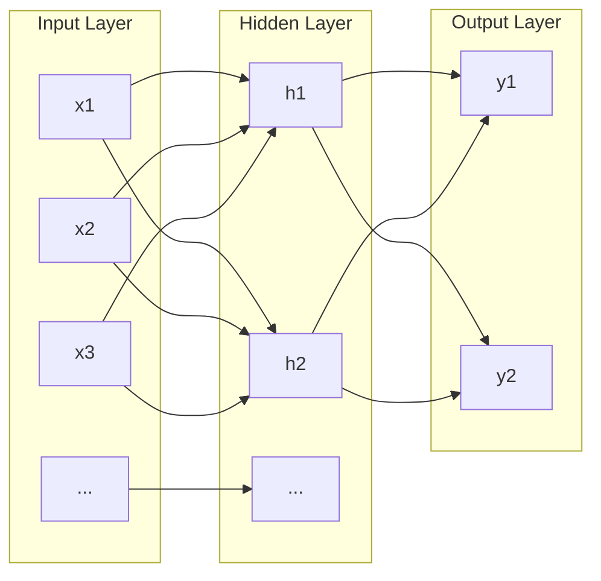
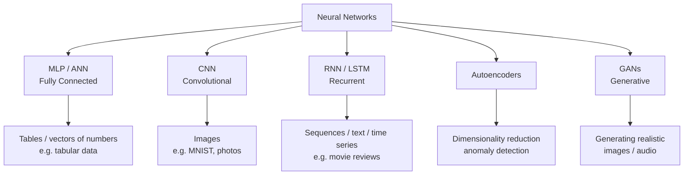
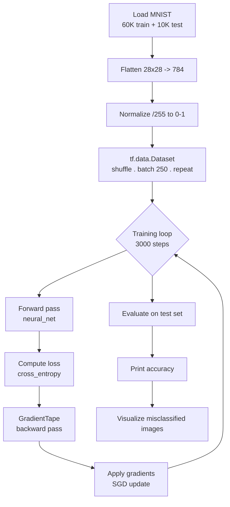
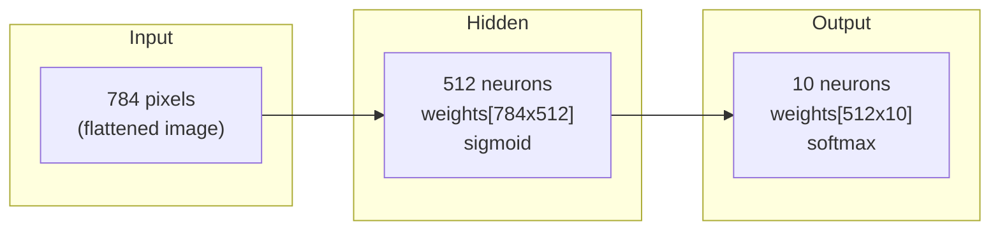
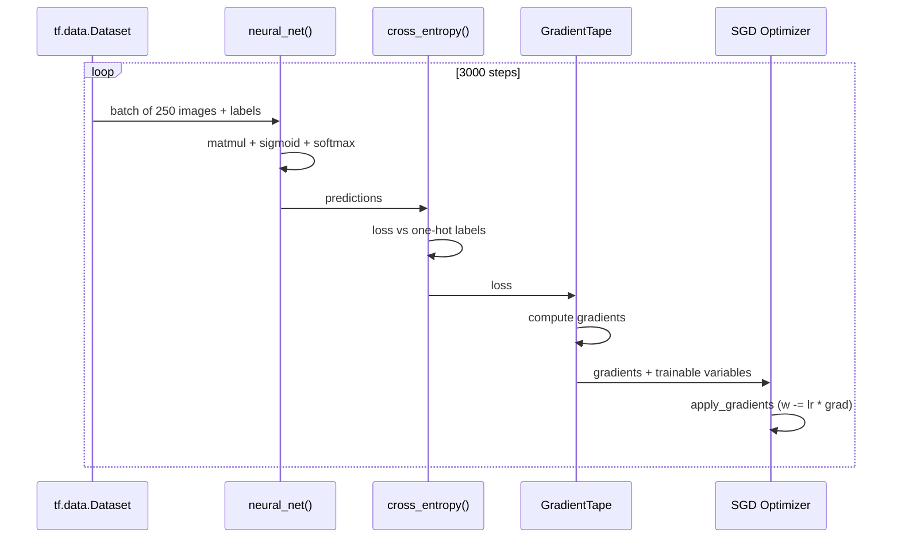

# TensorFlow & Neural Networks Guide

## Table of Contents

1. [Introduction](#introduction)
2. [What is a Neural Network?](#what-is-a-neural-network)
3. [Anatomy of a Neuron](#anatomy-of-a-neuron)
4. [Types of Neural Networks](#types-of-neural-networks)
5. [Key Concepts](#key-concepts)
6. [TensorFlow Fundamentals](#tensorflow-fundamentals)
7. [Program Walkthrough: `src/tensorflow_nn.py`](#program-walkthrough-srctensorflow_nnpy)
8. [Flow Diagrams](#flow-diagrams)
9. [Improving the Model](#improving-the-model)
10. [Exercises](#exercises)

---

## Introduction

TensorFlow is Google's open-source framework for building and training
machine learning models, with a particular focus on **deep neural
networks**. It lets you describe computations as **dataflow graphs** of
tensors (multi-dimensional arrays) and automatically computes gradients
through them, which is what makes training large networks feasible.

This guide explains the theory behind neural networks and then walks
through `src/tensorflow_nn.py`, a from-scratch (no Keras layers) neural
network that recognizes handwritten digits from the MNIST data set.

---

## What is a Neural Network?

A neural network is a machine learning model loosely inspired by the brain.
It is composed of **layers of neurons** connected by **weighted links**.
Data flows from an **input layer**, through one or more **hidden layers**,
to an **output layer**.

Each neuron:

- receives one or more inputs,
- multiplies each input by a **weight** (its importance),
- sums the weighted inputs plus a **bias**,
- applies a non-linear **activation function**,
- passes the result to the next layer.

The magic of training is that the network *learns* the right weights and
biases from data — no human needs to specify the rules.



### Why "Deep"?

A network with **one hidden layer** is a "shallow" neural network. A
network with **many hidden layers** is a *deep* neural network — hence the
term **deep learning**. Each layer learns increasingly abstract features:
the first layer might learn edges, the next shapes, and deeper layers
learn whole objects (e.g. digits).

---

## Anatomy of a Neuron

The computation inside a single neuron is:

```
z = w1*x1 + w2*x2 + ... + wn*xn + b
a = activation(z)
```

where:

| Symbol        | Meaning                                                    |
| ------------- | ---------------------------------------------------------- |
| `x1 ... xn`   | inputs from the previous layer                             |
| `w1 ... wn`   | weights (importance of each input) — **learned**           |
| `b`           | bias (shifts the decision boundary) — **learned**          |
| `z`           | weighted sum (also called the *logit* before softmax)      |
| `activation`  | non-linear function applied to `z`                         |
| `a`           | neuron output fed to the next layer                        |

In `tensorflow_nn.py` this exact computation appears as:

```python
hidden_layer = tf.add(tf.matmul(input_data, weights['h']), biases['b'])
hidden_layer = tf.nn.sigmoid(hidden_layer)
```

### Activation Functions

Activation functions add **non-linearity**. Without them, stacking layers
would just be linear algebra and the network could never learn complex
patterns.

| Activation | Formula                     | When to use                              |
| ---------- | --------------------------- | ---------------------------------------- |
| Sigmoid    | `1 / (1 + e^-z)`            | Hidden layers; output for binary problems |
| ReLU       | `max(0, z)`                 | Hidden layers (default choice today)      |
| Softmax    | `e^z_i / sum(e^z)`          | Output layer for multi-class problems     |

The program uses **sigmoid** on the hidden layer and **softmax** on the
output layer. Softmax converts raw scores into a probability distribution
over the 10 digit classes.

---

## Types of Neural Networks



### 1. Multi-Layer Perceptron (MLP / ANN)

- Every neuron in one layer connects to **every** neuron in the next.
- Best for tabular / vector data.
- Example: `tensorflow_nn.py` and `keras_mlp.py`.

### 2. Convolutional Neural Network (CNN)

- Uses **filters** (kernels) that slide over the input to detect local
  patterns; is *less sensitive to where a pattern appears* in an image.
- Uses pooling layers to shrink feature maps.
- Example: `keras_cnn.py`.

### 3. Recurrent Neural Network (RNN / LSTM)

- Has a **memory**: hidden state is fed back into the network over time.
- Ideal for sequences — text, speech, time series.
- LSTM (Long Short-Term Memory) cells avoid "forgetting" important words.
- Example: `keras_rnn.py`.

### 4. Autoencoders

- Learn to *compress* input into a smaller representation, then rebuild it.
- Used for dimensionality reduction, denoising, anomaly detection.

### 5. GANs (Generative Adversarial Networks)

- Two networks (generator + discriminator) compete to produce realistic
  synthetic data (images, audio, text).

---

## Key Concepts

### Tensor

The fundamental data structure — a **multi-dimensional array**.

| Dimensions | Name      | Example shape             |
| ---------- | --------- | ------------------------- |
| 0          | Scalar    | `()`                      |
| 1          | Vector    | `(784,)` one flattened image |
| 2          | Matrix    | `(32, 784)` a batch of 32 images |
| 3+         | N-D array | `(28, 28, 1)` a grayscale image |

In `tensorflow_nn.py`, a batch of 250 images is a tensor of shape
`(250, 784)`.

### Weight & Bias

- **Weights** determine how strongly an input influences a neuron.
- **Bias** lets a neuron fire even when all inputs are zero.
- Both are stored as `tf.Variable` because they are **updated during
  training**.

### Loss Function

Measures how wrong the predictions are. Lower is better. The program uses
**cross-entropy**, which penalizes confidently wrong predictions much more
than nearly-right ones.

### Optimizer

The algorithm that updates weights using gradients. The program uses
**SGD** (Stochastic Gradient Descent).

### Learning Rate

How big each weight update is. Too big → the model overshoots and diverges.
Too small → training is painfully slow. `0.001` here.

### Epoch / Step / Batch

| Term     | Meaning                                              |
| -------- | ---------------------------------------------------- |
| Sample   | One input (e.g. one image)                           |
| Batch    | A group of samples processed together (250 here)     |
| Step     | One optimizer update on one batch (3000 steps total) |
| Epoch    | One full pass over the whole data set                |

### Gradient Descent

The learning loop:

1. Forward pass → compute predictions.
2. Compute loss (prediction vs. truth).
3. Backward pass → compute the **gradient** of the loss w.r.t. every weight
   (how much each weight contributed to the error).
4. Update each weight a small step *against* the gradient.

```
w_new = w_old - learning_rate * gradient(loss, w_old)
```

### Train / Test Split

- **Train set**: images the network learns from.
- **Test set**: images it has *never seen*, used to check whether the model
  generalizes (this avoids "giving students a math test for problems they
  already have the answers for").

### One-Hot Encoding

Labels are converted from an integer (`5`) to a 10-length vector with a
single 1 (`[0,0,0,0,0,1,0,0,0,0]`) so they can be compared directly to the
network's 10 output neurons.

### Overfitting

When the model memorizes the training data but fails on new data. Symptoms:
training accuracy much higher than test accuracy. Cures: more data,
dropout, early stopping, regularization.

---

## TensorFlow Fundamentals

### `tf.Variable`

Stateful, trainable tensors — the weights and biases.

```python
random_normal = tf.initializers.RandomNormal()
weights = {'h': tf.Variable(random_normal([784, 512]))}
```

### `tf.data.Dataset`

Declarative data pipelines: load → shuffle → batch → prefetch.

```python
train_data = tf.data.Dataset.from_tensor_slices((x_train, y_train))
train_data = train_data.repeat().shuffle(60000).batch(250).prefetch(1)
```

### `tf.GradientTape`

The modern replacement for TensorFlow 1.x sessions. It *records* every
operation inside its block and can then compute gradients of a loss with
respect to any trainable variable.

```python
with tf.GradientTape() as g:
    pred = neural_net(x, weights, biases)
    loss = cross_entropy(pred, y)
gradients = g.gradient(loss, trainable_variables)
```

### Eager Execution

TensorFlow 2 runs operations immediately (like normal Python), so you can
read a tensor with `.numpy()`:

```python
model_prediction = np.argmax(predictions.numpy()[i])
```

---

## Program Walkthrough: `src/tensorflow_nn.py`

The program builds a `784 -> 512 -> 10` multi-layer perceptron *without*
any Keras layer classes, so you can see every moving part.

### Hyper-parameters

```python
NUM_CLASSES = 10      # digits 0-9
NUM_FEATURES = 784    # 28 * 28 flattened pixels
LEARNING_RATE = 0.001
TRAINING_STEPS = 3000
BATCH_SIZE = 250
DISPLAY_STEP = 100    # print progress every 100 steps
N_HIDDEN = 512        # neurons in the hidden layer
```

### Step-by-step

#### 1. `load_data()` — prepare MNIST

```python
(x_train, y_train), (x_test, y_test) = mnist.load_data()
x_train = x_train.reshape([-1, 784]).astype('float32') / 255.
```

- Loads 60,000 training + 10,000 test images.
- **Flattens** each 28x28 image into 784 numbers.
- **Normalizes** pixels from `[0, 255]` to `[0, 1]` (helps gradient descent
  converge).

#### 2. `build_train_dataset()` — batch pipeline

```python
train_data = tf.data.Dataset.from_tensor_slices((x_train, y_train))
train_data = train_data.repeat().shuffle(60000).batch(250).prefetch(1)
```

- `.shuffle(60000)` randomizes order each step (avoids learning order bias).
- `.batch(250)` groups 250 images per optimizer step.
- `.repeat()` lets us iterate infinitely and `.take(3000)` pulls exactly
  3000 batches.

#### 3. `create_weights()` — the learnable parameters

```python
weights = {
    'h':   tf.Variable(random_normal([784, 512])),   # input -> hidden
    'out': tf.Variable(random_normal([512, 10])),    # hidden -> output
}
biases = {
    'b':   tf.Variable(tf.zeros([512])),
    'out': tf.Variable(tf.zeros([10])),
}
```

Weights start small and random; biases start at zero.

#### 4. `neural_net()` — the forward pass

```python
hidden_layer = tf.add(tf.matmul(input_data, weights['h']), biases['b'])
hidden_layer = tf.nn.sigmoid(hidden_layer)

out_layer = tf.matmul(hidden_layer, weights['out']) + biases['out']
return tf.nn.softmax(out_layer)
```

For a batch of 250 images this computes:

```
(250, 784) @ (784, 512) + (512,)  -> (250, 512)   # hidden layer
(250, 512) @ (512, 10)  + (10,)   -> (250, 10)    # logits
softmax over 10 columns            -> probabilities
```

#### 5. `cross_entropy()` — the loss

```python
y_true = tf.one_hot(y_true, depth=10)               # 5 -> [0,0,0,0,0,1,...]
y_pred = tf.clip_by_value(y_pred, 1e-9, 1.)         # avoid log(0)
return tf.reduce_mean(-tf.reduce_sum(y_true * tf.math.log(y_pred)))
```

#### 6. `run_optimization()` — the learning step

```python
with tf.GradientTape() as g:
    pred = neural_net(x, weights, biases)
    loss = cross_entropy(pred, y)
gradients = g.gradient(loss, list(weights.values()) + list(biases.values()))
optimizer.apply_gradients(zip(gradients, trainable_variables))
```

This is the heart of training: compute gradients, nudge the weights.

#### 7. `accuracy()` — the metric

```python
correct = tf.equal(tf.argmax(y_pred, 1), tf.cast(y_true, tf.int64))
return tf.reduce_mean(tf.cast(correct, tf.float32))
```

#### 8. `train()` — the main loop

```python
for step, (batch_x, batch_y) in enumerate(train_data.take(3000), 1):
    run_optimization(batch_x, batch_y, weights, biases, optimizer)
    if step % 100 == 0:
        print("Training epoch: %i, Loss: %f, Accuracy: %f" % (step, loss, acc))
```

#### 9. `evaluate()` & `visualize_misclassifications()`

Run the trained model on the **test** set, print accuracy, and plot images
it got wrong so you can eyeball the failures.

---

## Flow Diagrams

### End-to-end pipeline



### The network architecture



### The training loop in detail



---

## Improving the Model

The baseline gets **~93% test accuracy**. Ideas to push higher:

1. **More hidden neurons** (`N_HIDDEN = 1024`) — more capacity.
2. **More layers** — add a second hidden layer (a "deep" net).
3. **Different learning rates** — try `0.01`, `0.0005`.
4. **Bigger batches / more steps** — smoother or longer training.
5. **ReLU instead of sigmoid** — often converges faster and avoids
   vanishing gradients.
6. **Dropout** — add `tf.nn.dropout` between layers to fight overfitting.

### Compare with the Keras programs

| Program          | API        | Hidden layer | Expected accuracy |
| ---------------- | ---------- | ------------ | ----------------- |
| `tensorflow_nn.py` | Raw TF 2  | 512 sigmoid  | ~93%              |
| `keras_mlp.py`   | Keras      | 512 ReLU + dropout | ~97-98%      |
| `keras_cnn.py`   | Keras      | Conv layers   | >99%              |

This comparison shows why we move to higher-level APIs (Keras) and better
architectures (CNN) — same problem, better results with less code.

---

## Exercises

1. Change `LEARNING_RATE` to `0.01` and `0.0001`. What happens to loss?
2. Change `N_HIDDEN` to 256 and 1024. How does accuracy change?
3. Add a second hidden layer of 256 neurons. Does accuracy improve?
4. Replace `tf.nn.sigmoid` with `tf.nn.relu` in `neural_net()`.
5. Reduce `TRAINING_STEPS` to 500 — how much does accuracy drop?
6. Modify the model to predict on your own handwritten image (resize to
   28x28, flatten, normalize).

---

*Next in the series: see `keras_mlp.py`, `keras_cnn.py`, and `keras_rnn.py`
for higher-level and more powerful architectures, and `q_learning.py` for
reinforcement learning.*